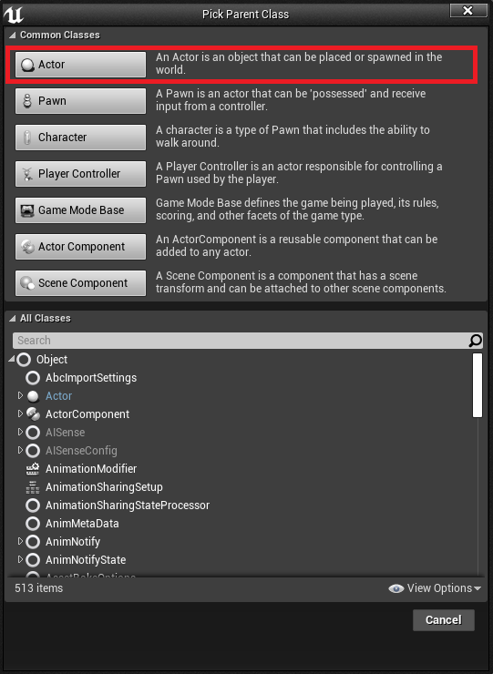
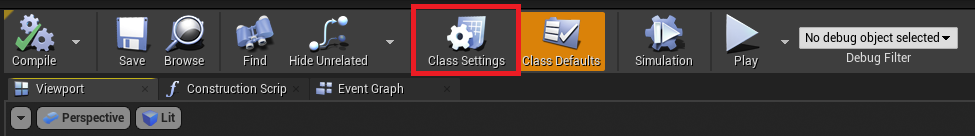
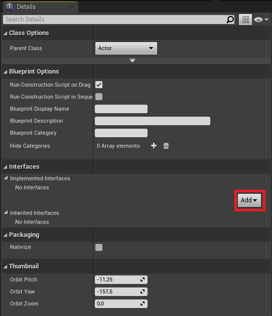
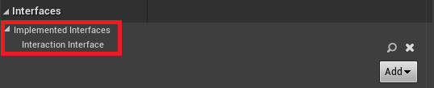
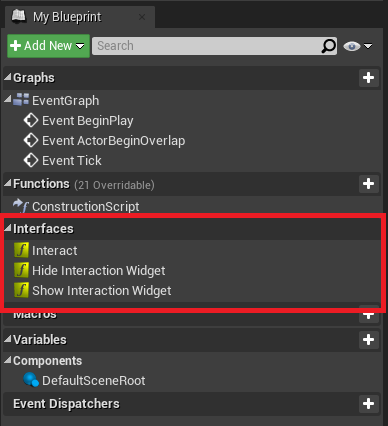
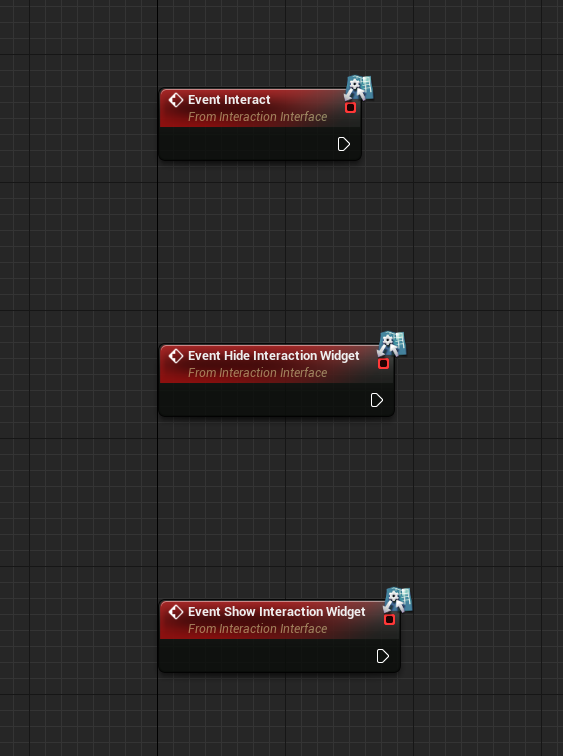
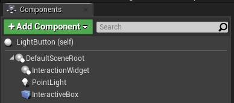
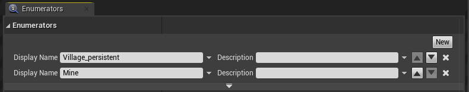
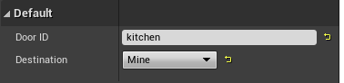
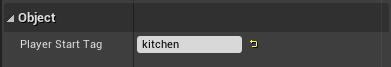

# Interaction System

Important Blueprints :

- **InteractionInterface** : Blueprint Interface;
- **ThirdPersonCharacter** : Playable character blueprint of the game;
- **InteractionWidget** : Widget Blueprint.

An Example : **LightButton**: a simple blueprint with a light.

## InteractionInterface

Is an Interface : it does not handles any logic.
The purpose of an Interface is to provide functions which can be implemented in multiple blueprints across the project.

This Blueprint Interface provides 3 functions :

- *ShowInteractionWidget* : Used when the player overlap interactable objects.
- *HideInteractionWidget* : Used when the player does NOT overlap interactable objects.
- *Interact* : Use the interaction.

This is the base of every interaction. We can imagine to add more functions to implement.

When the player overlap the interactable object, the widget shows up above it. To interact, the player needs to press the interaction button defined in the project settings (currently set to F).

If multiple players can be interacted with at the same time, the player choose the closer one. (You can see how everything works in the **ThirdPersonCharacter**)

## Creating an Interactable Object

First create an Actor Blueprint Class.

Open the Blueprint and got to Class Settings.

In the "Details" panel, implement the **InteractionInterface**.

On the "My Blueprint" panel you can now see the 3 methods.

Right click on them and select "Implement Function".
You should see this in the Event Graph.

And lastly, we need to add a simple **Box Collision** component. This ensure that our **ThirdPersonCharacter** detects this interactable object.

Now, you have everything set to do as you please !

Note : for *Show/HideInteractionWidget* you can use whatever you want as a visual feedback (on screen message, hovering text above object, etc ...) It is only used to show or hide the possible interaction !

# Level System

This is an application of the interaction System (not going in details but check it out to see how it works !).

Important Blueprints : 

- **LevelLoader** : Actor Blueprint implementing the **InteractionInterface** Blueprint. It handles the level loading.
- **PlayerStart** : Player Spawn after loading a level.
- **LevelList_Enum** : Enumeration List.

## Filling LevelList_Enum

First of all, we just need to fill this enum with level names :

Each entry have an ID begin at 0 at top.
So in this example :

- "Village_persistent" - 0
- "Mine" - 1

## Adding a level loading

For a single "door" / "portal" (let's call them portal for now) between 2 levels you need to do 2 things in each level :

- Place a **LevelLoader**. It represent the portal to another level.
- Place a **PlayerStart**. It represent the spawning position when the portal of the other map is crossed.

So **LevelLoader** of the level A spawn the player at the **PlayerStart** of level B. And vice-versa.

### Linking them

A **LevelLoader** has 2 variables : 

The *Destination* is one entry of the **LevelList_Enum**. In this case I set it to "Mine". This means that when entering this portal, the game will load the "Mine" level.

The *DoorID* is a name linking the **PlayerStart** on the other map. In this case it is "kitchen"

A **PlayerStart** has 1 variable called "Player Start Tag".

It must be set to the same name as the *DoorID* of the last map, so "kitchen" in our example.

So to link a 2-way portal we must do this :

| Level name         | Village_Persistent | Mine               |
| ------------------ | ------------------ | ------------------ |
| *Destination*      | Mine               | Village_Persistent |
| *DoorID*           | kitchen            | kitchen            |
| *Player Start Tag* | kitchen            | kitchen            |

As you can see, each *DoorID* & *Player Start Tag* as the same name.

Note : If a level contains multiple sub-level (level streaming). A portal in another level must reference to the main level.